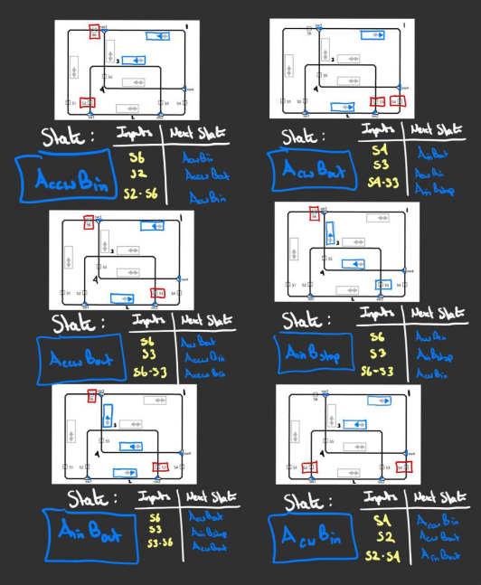
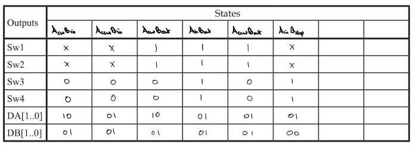
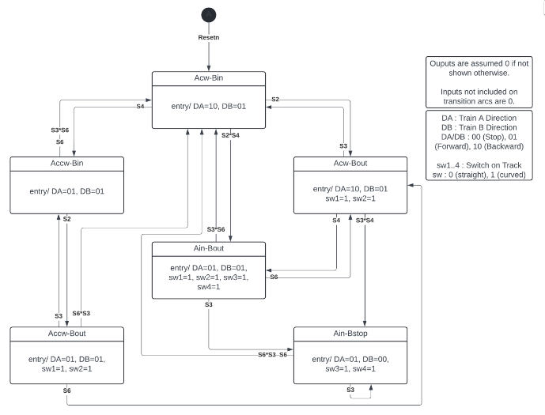

# Train Controller

This project is a VHDL-based train controller that manages train direction and track alignment using motion sensors placed along segmented sections of the track. By detecting the train's position, the controller adjusts the track orientation (stright or diverted) enabling precise and responsive routing across the rail system.  

Implemented in:
- FPGA (vhdl)

## Worksheet State Diagrams

Worksheet diagrams of train controller current states and corresponding signals, along with next state based on current state and inputs.  

## Signal Output Table

Describes which signals are active during each state for the train controller.  

## Train Controller State Diagram

Created from corresponding worksheet diagrams and output table.
